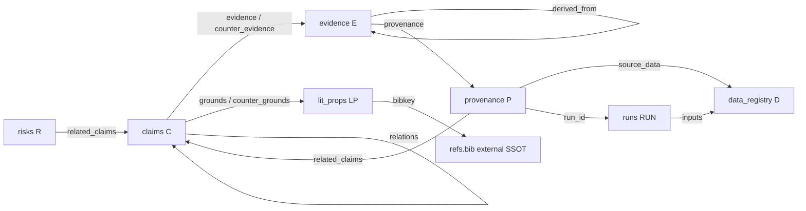

# .project 내부 클래스 의존성 그래프

상태: 2026-06-28 실측. 이 문서는 `.project` 공유 store의 주요 객체 클래스를 코드 클래스가 아니라 canon/operation 레코드 클래스로 본다.

## 핵심 그래프

## 클래스 책임

| 클래스 | 위치 | 책임 | 정본 링크 |
| --- | --- | --- | --- |
| `claims` | `.project/claims/` | 원고에 들어가는 검증/해석 주장 | `evidence -> evidence`, `counter_evidence -> evidence`, `grounds -> lit_props`, `relations -> claims` |
| `evidence` | `.project/evidence/` | 사용자가 입력·등록한 근거 정본. 시스템은 내용을 생성하지 않고 provenance/derived_from 연결만 검증 | `provenance -> provenance`, `derived_from -> evidence` |
| `provenance` | `.project/provenance/` | 수치/표/파이프라인 결과의 산출 근거 | `source_data -> data_registry`, `run_id -> runs`, `related_claims -> claims` |
| `data_registry` | `.project/data_registry/` | 자료원 정본 | provenance와 run이 참조 |
| `runs` | `.project/runs/` | 실행 단위 정본 | `inputs -> data_registry` |
| `lit_props` | `.project/lit_props/` | 문헌 명제 정본 | `bibkey -> refs.bib` |
| `risks` | `.project/risks/` | 심사/해석 위험과 완화 | `related_claims -> claims` |
| `promotions/decisions` | `.project/promotions/decisions/` | 팀/프로젝트 승격 판단 로그 | 후보를 닫는 decision, canon 본문과 분리 |
| `promotions/candidates` | `.project/promotions/candidates/team.json` | 현재 pending 승격 후보 | runtime/generated, 단일 shard |
| `derivations/candidates` | `.project/derivations/candidates/team.json` | 현재 pending 파생 후보 | runtime/generated, 단일 shard |

## 정리 결정

- `RUN-UNSPECIFIED`는 제거했다. `P001`~`P010`은 `RUN001`~`RUN005`에 직접 연결한다.
- `source_data=D001` 과잉 연결은 제거했다. HLM 계열은 `D001`, 텍스트/LLM/Stage E 계열은 `D002`, UMC 지수/z_shift 계열은 `D003`을 가리킨다. `P004`와 `P005`는 단일 `source_data` 제약 때문에 주 입력 `D002`를 가리키고, `D003` 보조 입력은 `RUN004.inputs`에서 표현한다.
- `number` 클래스는 제거하고 `evidence` 클래스로 승격했다. 기존 `N###` 레코드는 `E###` evidence 레코드로 이동했으며, claim의 `evidence[]`/`counter_evidence[]`는 E-id만 가리킨다.
- 팀-tier promotion/derivation 후보는 runner별 파일이 아니라 `team.json` 하나만 유지한다. 같은 전역 신호가 워커별로 복제되는 것을 막기 위한 결정이다.
- `.project/.DS_Store`와 과거 runner별 candidate shard는 불필요한 generated/OS 파일이라 제거했다.
- `.project/assets/Research_Literature_Master.xlsx.dc-backup-20260627`은 현재 xlsx와 `sheet2.xml` 내용이 달라 삭제하지 않았다.
